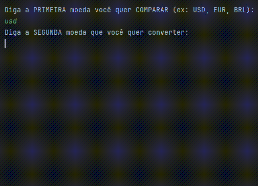

<h1 align="center">
  
</h1>

<h1 align="center">
  
</h1>

Este projeto é uma aplicação em Java que permite comparar e converter taxas de câmbio entre duas moedas diferentes. Ele consome uma API externa de taxas de câmbio para realizar as consultas e exibir o resultado no console.

## Funcionalidades

- Consultar a taxa de câmbio de uma moeda base.
- Converter o valor de uma moeda para outra.
- Exibir as siglas das moedas envolvidas na conversão.
- Tratamento de erros para moedas não encontradas.

## Tecnologias Utilizadas

- **Java**: Linguagem de programação principal.
- **API Externa**: [ExchangeRate-API](https://www.exchangerate-api.com/) para a consulta de taxas de câmbio.
- **Gson**: Biblioteca utilizada para o parsing de JSON.
- **HttpClient**: Para realizar requisições HTTP.

<h1 align="center">

</h1>
